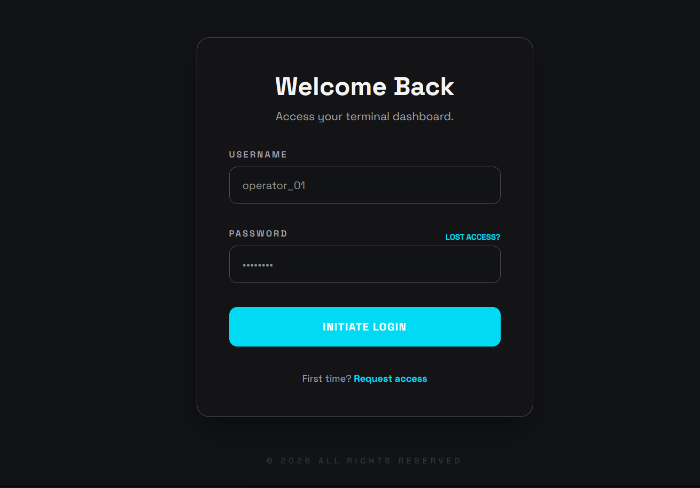
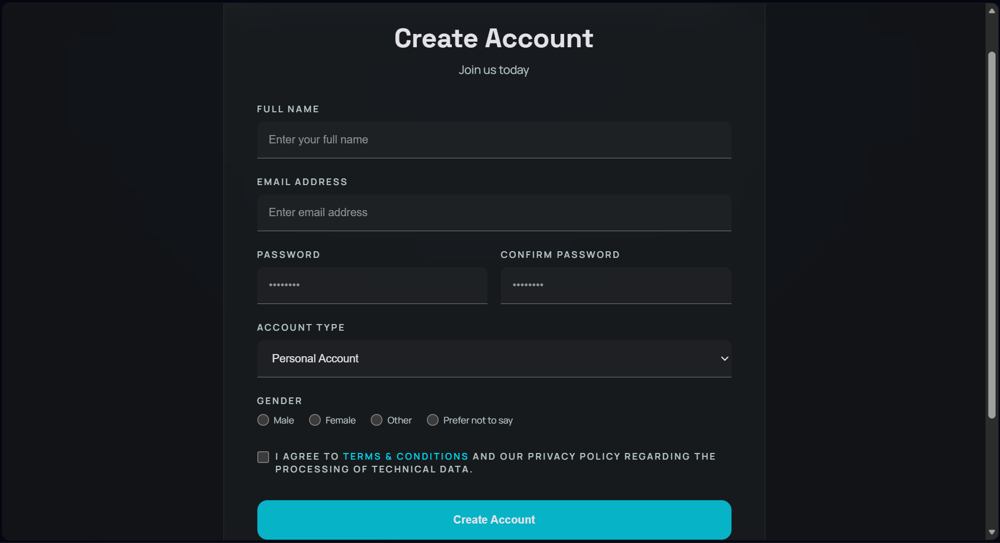
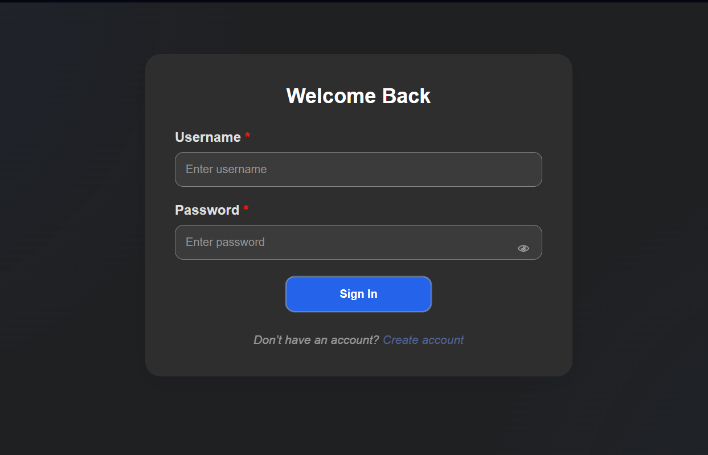
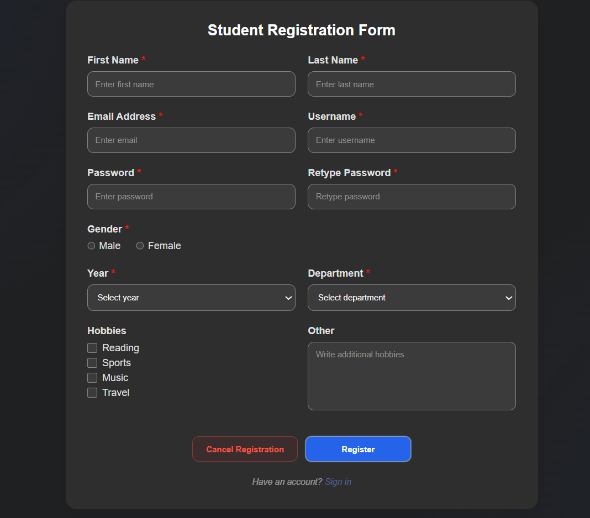

# Login + Signup Authentication & Registration Systems

A modern PHP-based project containing a **SaaS Authentication System** and a **Student Registration System**, both designed with clean UI, structured backend logic, and responsive layouts.

---

## 🚀 Project Overview

This repository contains two independent systems:

### 1. SaaS Authentication System
A dark-mode login and signup interface built with PHP and a modern SaaS-inspired design.

### 2. Student Registration System
A simple full user flow system including landing page, authentication, and dashboard functionality.

---

## ✨ Features

---

## 🔐 SaaS Authentication System
- Secure login form
- User registration form
- PHP-based form handling
- Client-side form validation
- Minimal SaaS-style dark UI
- Responsive design across devices

---

## 🎓 Student Registration System

A lightweight user system that simulates a basic student portal workflow.

### 📌 Pages Included:

#### 🏠 Landing Page
- Simple homepage introduction
- Navigation to **Sign In** or **Register**
- Clean and minimal UI

#### 📝 Registration Page
- Student registration form
- PHP form handling
- Input validation (basic client-side checks)
- Stores user input (extendable to database)

#### 🔐 Sign In Page
- User authentication form
- Login validation using PHP
- Redirects to dashboard on success

#### 📊 Dashboard Page
- Accessible after successful login
- Displays welcome message
- Acts as a user landing area after authentication
- Can be extended into full student management system

---

## 🧠 Purpose

This project demonstrates:
- Multi-system organization in a single repository
- PHP-based authentication and form handling
- Clean separation between SaaS and Student systems
- Basic full-stack workflow (Landing → Auth → Dashboard)
- Scalable structure for future database integration

---

## 📁 Project Structure

- SaaS system (authentication-focused)
- Student system (full user flow system)
- Independent modules inside one repository for clarity and scalability

---

## 📸 Screenshots

### SaaS System

---

### Student System

---

## 🔧 Tech Stack
- HTML
- CSS
- JavaScript
- PHP
- XAMPP (local development server)

---
